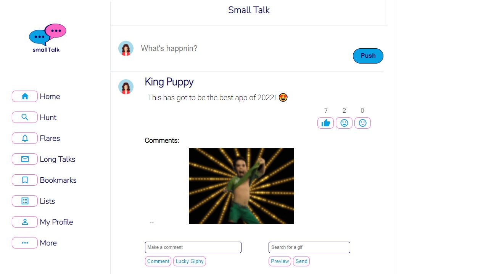

# smallTalk

SmallTalk is the place to be if you want to post a quirky comment, funny gif or rant about how you are overworked :(
This community driven website has been seperated into client side and server side repos to minimise risks to our code.
So welcome to our client-side Repo and take a read below to find out more!

## About smallTalk

smallTalk has the following functionalities:

- Users can visit smallTalk and anonymously post journal entries being assigned a quirky name with each post.
- We want to encourage smaller more playful conversations so we limited each post to 150 characters (comments to 30).
- Users can react to posts with either a random trending gif or a specific searched gif
- Users can view other peoples' entries.
- Users can react to other peoples’ entries with either a like, happy or sad emoji.
- Users can also comment on other people’s entries.

### Installation

1. Clone the repo
2. Using the terminal of your choice -> `Git Clone 'SSH or HTTPS key'`
3. Install the node packages -> `npm i`

### Usage

1. Navigate to the smallTalk_Client folder
2. Open a Terminal
3. Enter `npm run dev` to run a local client which is connected to our heroku server

### Technologies

- JavaScript
- Live Server
- Jest
- Netlify
- Google Fonts and Icons
- Giphy API (limited to 42 posts per hour)

###### Live Server

You can access a live server of smallTalk but simply running the `dev` script. The live server takes advantage of the npm script `currently` to start the `watchify` bundler and a http-server.

- Install: `npm i -D watchify concurrently http-server`
- Script: `"dev": "concurrently \"watchify ./client/script.js -o bundle.js\" \"http-server\""`

###### Jest

We used Jest to test our code and our coverage. To do this we install Jest as a dev dependency;

- `npm i -D jest`

  We used custom scripts to our package.json to constantly check our code check our coverage;

- `"test": "jest --watchAll"`
- `"coverage": "jest --coverage"`

To test the DOM we used the `jest-environment-jsdom`

- `npm i --D jest-environment-jsdom`

To test the fetch API we used a jest library `jest-fetch-mock`

- `npm i --D jest-fetch-mock`

###### Netlify

We launched our client on Netlify!

- [Look at smallTalk on Netlify](https://cool-rolypoly-62fa4c.netlify.app)

## The Process

1. We first set up a kanban board on the github projects tab, where we thought about the different functionalities we would need to implement and then distributed them between us
2. We decided that our journal should take only a post text to begin with and then each post would have the ability to add more detail with a new form created on each post.
3. 2 team members tackled the client side, creating a design and making some skeleton pseudo code functions.
4. A branch was made for each team member to work on as a developer with a parent staging branch which we all pushed to.
5. 2 team members tackled the server side, see the -[smallTalk_Server Repo](https://github.com/GMillerMc/smallTalk_Server)
6. Once the website had a basic HTML we started connecting the client to the server
7. The client was deployed on Netlify (see above for the link to smallTalk)
8. We completed the functionality of our journal so we could send and recieve more data from the server.
9. Began testing on our client side
10. Finished up the styling of the webpage
11. Push our final changes to the main branch of github

### Wins

- Added a unique feature that allows you to preview your gif before sending it
- Managed to implement Giphy as part of our comment section so you can react with a gif.
- Testing on the server side had an average of 70% coverage.
- Implemented a random name generator for each post.
- Successfully post the input fields to the server side that is on the herokuapp
- On the DOM being loaded, the previous posts are fetched from the server and displayed.
- Each post has there own ID so their content can be collected.

- **SOLVED** The index.html file has to be a top level file and now is deployed on Netlify.
- **SOLVED** Managed to add the new post in the post fetch method which invokes the createPost function.
- **SOLVED** When creating the elements, we added and event listener to them so we could target them in the after the DOM is loaded.

### Challenges

- Testing on the client side was poor (roughly XX% coverage).
- We attempted to use a bundler Watchify so we could keep our data seperate but had a few issues using the require method.

- ~~Netlify failing to load (may be to do with html file not being at the top)~~ **SOLVED**
- ~~Issue when posting new posts, that they do not appear until the page refreshes~~ **SOLVED**
- ~~We could not target elements created when a new post was created~~ **SOLVED**

### Bugs

- Random name gets reassigned each time the page is reloaded (Character Quirk, could be solved by saving the name and adding it to the server. We kept it in as it is a fun way for the posts to remain anonymous)

- ~~Each post gets appended to the bottom of the feed~~ **SOLVED**

- No other bugs we can find (Please inform us if you find any!)

### Future Features

- The top liked posts get pushed to the top of the journal feed
- The random Giphy button shows a selection of the trending gif where you can choose one to post
- An encryption - since it is an anonymous
- Multiple feeds for different topics
- Membership feed

### Licence

\*MIT
